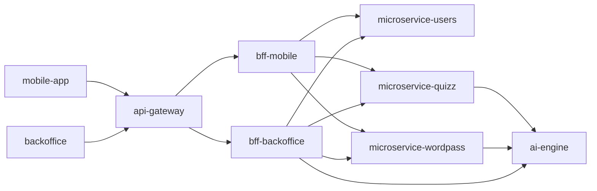

# AxiomNode

**AxiomNode** is an educational AI platform built as a multi-repository, microservice-oriented system. It combines mobile gameplay, an operator Backoffice, domain services, local/split LLM infrastructure, RAG-backed generation, CI/CD automation, observability, and centralized secrets governance.

The project is maintained as a Master's Thesis implementation, but the repositories are structured like a real platform: clear service boundaries, contract ownership, runtime diagnostics, deployment automation, and explicit documentation responsibility.

## What The Platform Does

- Generates and curates educational quiz and word-pass content through an internal AI Engine.
- Serves mobile-friendly gameplay APIs through a public gateway and mobile BFF.
- Provides an operator Backoffice for service inspection, runtime diagnostics, AI target visibility, and role-gated operations.
- Keeps shared contracts, SDK artifacts, infrastructure manifests, and secrets governance in dedicated repositories.
- Supports local development, staging rollouts on k3s, and controlled production promotion.

## Current Architecture

## Repository Map

### Experience Layer

- [`mobile-app`](https://github.com/AxiomNode/mobile-app): Kotlin Multiplatform client for Android, iOS, and Desktop JVM validation paths.
- [`backoffice`](https://github.com/AxiomNode/Backoffice): React operator console for diagnostics, inspection, and controlled admin actions.

### Public Edge And BFFs

- [`api-gateway`](https://github.com/AxiomNode/api-gateway): public ingress for mobile and Backoffice traffic.
- [`bff-mobile`](https://github.com/AxiomNode/bff-mobile): mobile-shaped orchestration layer.
- [`bff-backoffice`](https://github.com/AxiomNode/bff-backoffice): operator BFF and runtime control surface.

### Domain Services

- [`microservice-users`](https://github.com/AxiomNode/microservice-users): identity, sessions, roles, profile, stats, and leaderboard APIs.
- [`microservice-quizz`](https://github.com/AxiomNode/microservice-quizz): quiz generation orchestration, validation, persistence, and catalog APIs.
- [`microservice-wordpass`](https://github.com/AxiomNode/microservice-wordpass): word-pass generation orchestration, validation, persistence, and catalog APIs.

### AI Capability

- [`ai-engine`](https://github.com/AxiomNode/ai-engine): FastAPI-based AI service for RAG ingestion, structured game generation, local/split llama routing, cache behavior, and observability APIs.

### Governance And Operations

- [`docs`](https://github.com/AxiomNode/docs): central architecture, operational, validation, and capability documentation.
- [`contracts-and-schemas`](https://github.com/AxiomNode/contracts-and-schemas): canonical OpenAPI, JSON Schema, and event contracts.
- [`shared-sdk-client`](https://github.com/AxiomNode/shared-sdk-client): shared SDK and integration helper workspace.
- [`platform-infra`](https://github.com/AxiomNode/platform-infra): Kubernetes manifests, environment overlays, image build orchestration, and rollout workflows.
- [`secrets`](https://github.com/AxiomNode/secrets): private source of truth for runtime secrets, local injection, sync validation, and hardcoded-secret audits.
- [`observability-platform`](https://github.com/AxiomNode/observability-platform): dashboards, alert rules, and shared observability assets.
- [`runtime-seed`](https://github.com/AxiomNode/runtime-seed): seed-data generation and repair tooling for persisted educational inventories.

## Technology Stack

- **Frontend:** React, TypeScript, Vite, Material Design-oriented Backoffice UI.
- **Mobile:** Kotlin Multiplatform, Compose, Firebase/Google authentication integration.
- **Backend:** Fastify, TypeScript, FastAPI, Python, Zod, Prisma.
- **Data:** PostgreSQL, local JSON stores for selected BFF state, Chroma-backed RAG storage, Redis/cache integrations where configured.
- **AI Runtime:** local or split llama-compatible inference, structured prompts, RAG, KBD grounding, generation evaluation, and AI diagnostics.
- **Delivery:** GitHub Actions, GHCR, Docker, Kubernetes/k3s, Kustomize, environment overlays.
- **Governance:** contract validation, repository-scoped docs, centralized secrets injection, smoke tests, and CI-gated staging rollout.

## Current Delivery Model

Service repositories validate their own code first. Successful pushes to `main` dispatch `platform-infra` to build and publish images, then staging is rolled out automatically with smoke checks. Production remains a controlled manual promotion target.

`ai-engine` can run in split topology: API/stats services may be deployed in-cluster while the llama runtime remains external or workstation-hosted. Effective AI routing is therefore observable and controllable at runtime.

## Access And Review

Backoffice access is role-gated through `microservice-users`. The current role model includes `SuperAdmin`, `Admin`, `Inspector`, `Viewer`, and `Gamer`. `Inspector` is a read-only review role intended for academic or operational inspection: it can inspect role assignments and diagnostics without changing user permissions.

## Documentation

Start with [`docs`](https://github.com/AxiomNode/docs) for the current architecture, repository map, CI/CD workflow, runtime routing model, validation workflows, and operations guides. Repository-local README files document concrete local setup, ownership boundaries, endpoints, and validation commands.

## License

The public repositories are distributed under the MIT License unless a repository states otherwise.
